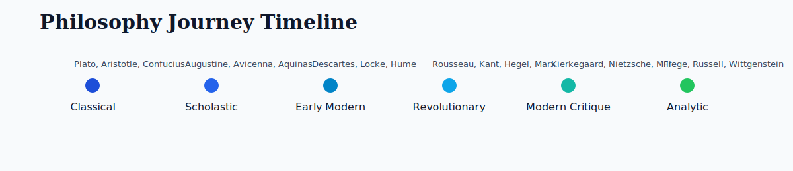

# Master Philosophers 🧠📚

Tip: update the streak badge with `make streak weeks=<n>`.
Visit the docs site: `https://dmoliveira.github.io/master-philosophers/`.

A practical learning space for anyone who wants to think more clearly by
studying great philosophers, logic traditions, big questions, and argument
patterns across history.

## New Here? 15-Minute Quick Start ⏱️

If you only have 15 minutes, do this:

1. Open `docs/authors.md` and read one thinker profile.
2. Jump to `docs/books.md` and pick one accessible edition.
3. Copy the weekly block in `docs/templates/weekly-study-checklist.md`.
4. Write one short reflection in `docs/reviews/core-book-reviews.md`.

By the end, you will have one concrete reading plan and one output.

If you want a full beginner launch path, use `docs/plan/week-zero-kickoff.md`.

## Start Here 🚀

1. Read the map in `docs/authors.md`.
2. Pick the matching books in `docs/books.md`.
3. Follow your cadence in `docs/plan/study-plans.md`.
4. Use the weekly template in `docs/templates/weekly-study-checklist.md`.
5. Capture reflections from `docs/reviews/core-book-reviews.md`.

## Choose by Goal 🎯

- New learner: `docs/plan/week-zero-kickoff.md`
- Site orientation: `docs/how-to-use-this-site.md`
- Weekly routine: `docs/plan/study-plans.md`
- Better argument skills: `docs/cheatsheets/logic-drills.md`
- Media-first learning: `docs/resources/media-watchlists.md`
- Full route map: `docs/resources/navigation-map.md`
- Website rollout proposal: `docs/plan/github-pages-site-map.md`

## Study Hub Extensions 🧰

- Learning resources hub: `docs/resources/learning-resources.md`
- Media watchlists by level: `docs/resources/media-watchlists.md`
- Regional/language access alternatives: `docs/resources/access-alternatives.md`
- Discussion prompt bank: `docs/resources/discussion-prompt-bank.md`
- Timeline gallery: `docs/resources/timeline-gallery.md`
- Source freshness log: `docs/resources/source-freshness-log.md`
- Navigation map: `docs/resources/navigation-map.md`
- Argument cheat sheet: `docs/cheatsheets/argument-analysis-cheat-sheet.md`
- Logic drills: `docs/cheatsheets/logic-drills.md`
- One-page study sheet: `docs/cheatsheets/one-page-study-sheet.md`
- Thinker comparison sheet: `docs/cheatsheets/thinker-comparison-sheet.md`
- Philosopher quick map: `docs/cheatsheets/philosopher-quick-map.md`
- Progression paths: `docs/plan/progression-paths.md`
- Enrichment roadmap and pass tracking: `docs/plan/enrichment-roadmap.md`
- GitHub Pages site map proposal: `docs/plan/github-pages-site-map.md`

## Visual Gallery 🖼️

Quick visual entry points to key thinkers:

| Thinker | Portrait |
|---|---|
| Plato |  |
| Socrates |  |
| Aristotle |  |
| Confucius |  |
| Augustine |  |
| Karl Marx |  |
| Friedrich Nietzsche |  |

Want the full map? Go to `docs/authors.md`.

## Image Credits 📷

- Portrait thumbnails are loaded from Wikimedia Commons pages linked above.
- Use each image link to reach source details and licensing context.

## Repository Index 🗂️

- `docs/authors.md`: all philosophers, key facts, and main intellectual shifts.
- `docs/books.md`: AU-focused buying list with links, AU prices, and fallback conversion logic.
- `docs/reviews/core-book-reviews.md`: short reading notes and practical review prompts.
- `docs/resources/learning-resources.md`: curated reference links, courses, and media.
- `docs/resources/media-watchlists.md`: beginner-to-advanced watch/listen tracks.
- `docs/resources/access-alternatives.md`: region/language and low-bandwidth fallback guidance.
- `docs/resources/discussion-prompt-bank.md`: leveled prompts for solo/group assessment.
- `docs/resources/timeline-gallery.md`: period-by-period visual timeline pack.
- `docs/resources/source-freshness-log.md`: external-link reliability checks and cadence.
- `docs/resources/navigation-map.md`: choose-your-path entry points by study goal.
- `docs/cheatsheets/argument-analysis-cheat-sheet.md`: fast argument reading method.
- `docs/cheatsheets/logic-drills.md`: short reasoning drills for weekly practice.
- `docs/cheatsheets/one-page-study-sheet.md`: printable single-page study worksheet.
- `docs/cheatsheets/thinker-comparison-sheet.md`: printable side-by-side thinker grid.
- `docs/cheatsheets/philosopher-quick-map.md`: one-glance map of thinkers and lanes.
- `docs/plan/study-plans.md`: structured 6-month and 12-month plans.
- `docs/plan/week-zero-kickoff.md`: first-session onboarding path for new learners.
- `docs/plan/progression-paths.md`: clear "what to read next" routes by goal.
- `docs/plan/enrichment-roadmap.md`: multi-pass content expansion tracker.
- `docs/plan/github-pages-site-map.md`: proposal to publish and link all docs on GitHub Pages.
- `docs/plan/zensical-migration-evaluation.md`: phased evaluation and cutover criteria for generator migration.
- `docs/plan/zensical-prototype-parity-checklist.md`: production cutover checklist for prototype parity validation.
- `docs/plan/zensical-prototype-execution-plan.md`: step-by-step prototype branch execution plan.
- `docs/plan/zensical-prototype-bootstrap-plan.md`: safe branch and preview workflow bootstrap sequence.
- `docs/plan/zensical-prototype-preview-log.md`: recorded preview runs and status evidence.
- `docs/plan/zensical-config-migration-checklist.md`: configuration migration checklist for prototype readiness.
- `docs/plan/zensical-prototype-ops-quick-ref.md`: quick command reference for prototype branch operations.
- `docs/plan/zensical-prototype-status-dashboard.md`: current readiness snapshot and next priorities.
- `docs/templates/zensical-prototype-review-report.md`: template for recording each prototype review pass.
- `docs/templates/zensical-prototype-handoff-checklist.md`: checklist for safe prototype handoff and next-step readiness.
- `.github/workflows/zensical-preview.yml`: preview artifact workflow scaffold for the `zensical-prototype` branch.
- `docs/templates/weekly-study-checklist.md`: reusable weekly execution template.
- `docs/templates/objection-reply-lab.md`: focused objection/reply practice worksheet.
- `docs/templates/exam-response-template.md`: concise structure for written prompt answers.
- `docs/specs/edition-selection-spec.md`: rules for choosing editions and upgrades.
- `docs/releases/v0.5.0.md`: release notes for Pages rollout, onboarding, and navigation updates.
- `docs/stats/reading-streak.md`: weekly check-in log and streak badge source.
- `Influential_Philosophers_Reading_Plan.md`: quick index for the reading flow.
- `CONTRIBUTING.md`: contribution and curation rules.

## Design Principles 🎯

- AU-first sourcing and pricing whenever possible.
- Prefer readable editions for first pass, critical editions for second pass.
- Split large content by concern (authors, books, plans, reviews).

## License 📄

MIT. See `LICENSE`.
