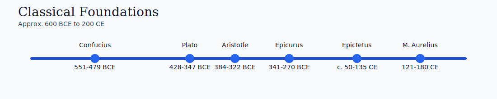
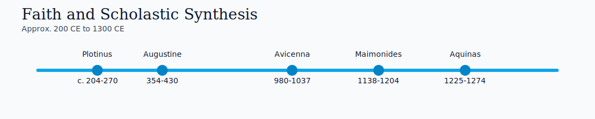
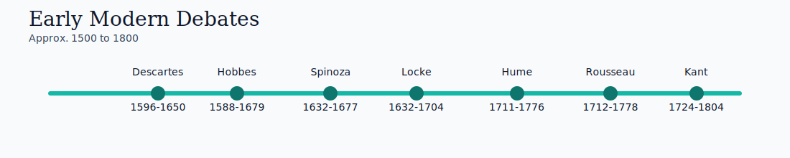
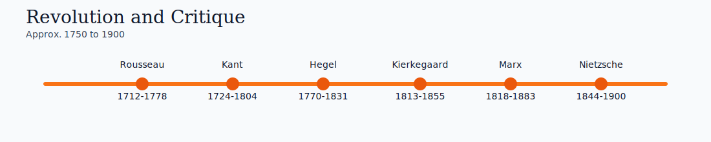
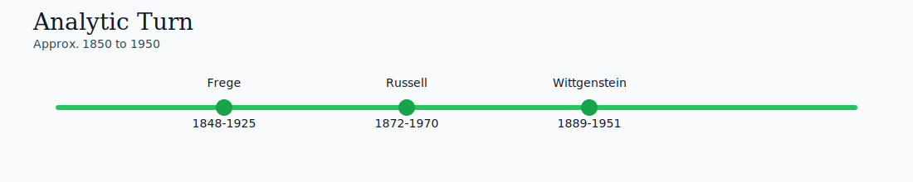

# Timeline Gallery 🕰️

Use these visuals for fast period orientation before reading.

## Classical Foundations

## Faith and Scholastic Synthesis

## Early Modern Debates

## Revolution and Critique

## Analytic Turn

